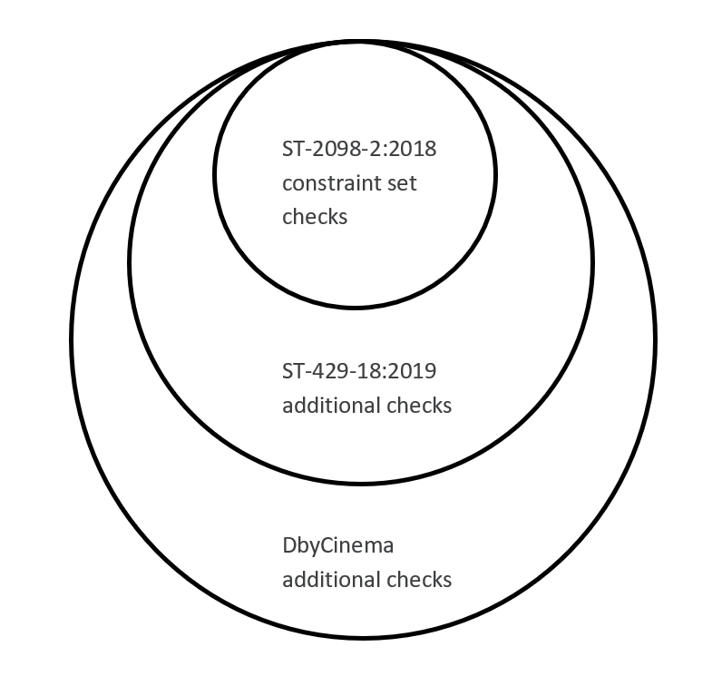
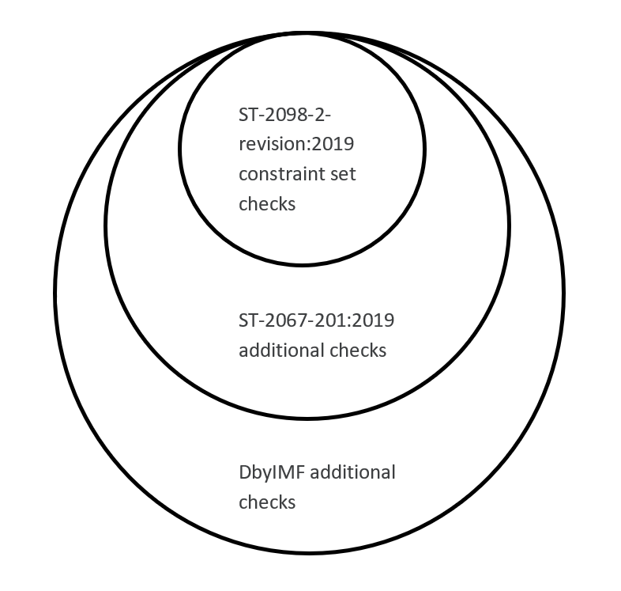

# `iab-validator` CLI: How to Run Validation and Read Report

## Introduction

This file contains the `iab-validator` help info text for reference. The command line application parses an IAB 
bitstream file and writes validation results to a report in JSON format.

Examples are also included to demonstrate how to run validation on a file-based serialized IAB stream using 
combinations of options for typical use scenarios.

Furthermore, to help readers to better understand validation report, further information on supported constraint 
profiles are provided to illustrate the hierarchical relationship among each of the 2 groups for digital cinema 
and IMF applications respectively.

## Help info for `iab-validator` 

The help text can be echoed to command/terminal console by invoking the CLI application with the *-h* or *--help*
option, as below.

    iab-validator -h
    
or

    iab-validator --help
    
### For reference, the full help text is included below.

```

	****** Xperi ProAudio SMPTE IAB Bitstream Validator Version 1.0.0  Feb 28 2020 ******

Usage: iab-validator -i<file path> [-c<N> | -cA] [-r1 | -r2] [-s] [-o<file path>] [-w] [-l<N>] [-h] [-ex]

 -i<file path>                  Full or relative path to the file for validation 


Option Summary:

 -c<N>,  --constraint_set<N>    Constraint Set Number. 
 -cA,    --constraint_set_all   All Constraint Sets. 
 -r1,    --report1              Generate summary report file.
 -r2,    --report2              Generate detailed report file.
 -s,     --single-file          Specifies single-file input.
 -o,     --output<file path>    File path of the output JSON report.
 -w,     --force_write          Overwrite any existing output report file.
 -l<N>,  --limit<N>             Teminate validation if number of found issues exceed N.
 -h,     --help                 Show this application usage information.
 -ex,    --ShowExamples         Show command line examples for selected validation use cases.


Validation Options:

 -c<N>,  --constraint_set<N>
  Validates and reports against constraint set number N. This option is mutually exclusive with -cA.
  Only one -c option is supported.
  Constraint Sets   N = 1 : Cinema ST2098-2-2018
                    N = 2 : Cinema ST429-18-2019
                    N = 3 : DbyCinema
                    N = 4 : IMF ST2098-2-2019
                    N = 5 : IMF ST2067-201-2019
                    N = 6 : DbyIMF

 -cA,    --constraint_set_all
  Validates and reports against all 6 constraint sets. This option is mutually exclusive with -c<N>.
  Default mode when both -c<N> and -cA are absent.


Input File Options:

 -s,     --single-file
  Specifies single-file input. When -s or --single-file is not specified, multi-file input is assumed.


Output Options:

 -r1,     --report1
  Generates the summary report file.

 -r2,     --report2
  Generates the detailed report file.

 -o,     --output<file path>
  Specifies the desired file path of the output report.
  (Default filename: <input_file_name>.json).

 -w,     --force_write
  Enables automatic overwrite of any existing output file.
  If not specified, warning is issued on any existing output file. Validation not performed.

 -l,     --limit<N> 
  Validation is terminated when the number of found issues exceed limit N.
  If not specified, all issues are logged.

 -h,     --help
  Displays the full CLI help guide. With -h or --help, other command line parameters
  are ignored. This option has priority over -ex and --ShowExamples.

 -ex,    --ShowExamples
  Show command line examples for selected validation use cases. With -ex or
  --ShowExamples, other command line parameters are ignored.

```

## Examples of running `iab-validator`

Several examples are provided below to illustrate typical usage cases.

### Example 1
Validate an IAB bitstream against the ST-2098-2:2018 constraint profile. In this case, all IAB frames of the 
bitstream are contained in a single file named `iabStream_1.iab`. A summary validation report, `iabStream_1.json` 
is generated which contains validation result against ST-2098-2:2018.

    iab-validator -iiabStream_1.iab -c1 -s -r1 

### Example 2
Validate an IAB bitstream against all supported validation profiles. In this case, all IAB frames of the 
bitstream are contained in a single file named `iabStream_2.iab`. A summary validation report, `iabStream_2.json` 
is generated which contains validation results against all of the 6 supported profiles.

    iab-validator -iiabStream_2.iab -cA -s -r1

### Example 3
Validate an IAB bitstream against ST-2098-2-revision:2019. In this case, the IAB bitstream is split into a frame 
sequence, in that, each IAB frame is contained in a separate file, all inside a folder named “IABStream_folder”. 
The individual files have a naming convention in this format: `iabStream_3_xxxxxx.iab` where xxxxxx is the 6-digit 
suffix identifying the IAB frame index in the sequence.  A summary validation report, `iabStream_3_.json` 
is generated inside the “IABStream_folder”. The report contains validation result against ST-2098-2-revision:2019.

    iab-validator -i./IABStream_folder/iabStream_3_.iab -c4 -r1 

For more examples, invoking `iab-validator` with the *-ex* or *--ShowExamples* option as below.

    iab-validator -ex
    
or

    iab-validator --ShowExamples

## Validation profiles hierarchy and dependency

The `iab-validator` supports validation of an IAB stream against one or all of the 6 constraint profiles. The 6 profiles
can be separated into two groups.

### Group 1: 3 validation profiles (levels) for Digital Cinema applications

* [ST-2098-2:2018](https://ieeexplore.ieee.org/document/8440792)
* [ST-429-18:2019](https://ieeexplore.ieee.org/document/8752542)
* DbyCinema (Contact www.dolby.com for `Dolby CP850 and Dolby IMS3000 Immersive Audio Bitstream Guidelines, Issue 3, 01-13-2020`.)
    
### Group 2: 3 validation profiles (levels) for IMF (Interoperable Master Format) applications

* [ST-2098-2-revision:2019](https://ieeexplore.ieee.org/document/8752533)
* [ST-2067-201:2019](https://ieeexplore.ieee.org/document/8786087)
* [DbyIMF](https://developer.dolby.com/technology/dolby-atmos/dolby-atmos-in-imf/imf-iab-interop-guidelines/)
    
The two groups are independent of each other. However, within each group, validation parameters defined in the respective 
3 profiles are related to each other as subset-superset.

### Hierarchy for digital cinema group of profiles
     
The set relationship among the 3 profiles for Digital Cinema applications is illustrated in Figure 1. __ST-2098-2:2018__ forms the *base profile (set)* 
for digital cinema applications. Set for profile __DbyCinema__ is a superset of __ST-429-18:2019__, which in turn is a superset of base set 
__ST-2098-2:2018__.



_Figure 1. Set relations for 3 Digital Cinema validation profiles_

### Hierarchy for IMF group of profiles
     
The set relationship among the 3 profiles for IMF applications is illustrated in Figure 2. Similarly, profile __ST-2098-2-revision:2019__ forms 
*base profile (set)* for IMF validation. Set for profile __DbyIMF__ is a superset of __ST-2067-201:2019__, which in turn is a superset of base 
set __ST-2098-2-revision:2019__.



_Figure 2. Set relations for 3 IMF validation profiles_

## Validation report in JSON

It is clear from the set relationship that, an IAB stream that is **valid** against base set, or a subset, does not infer validity against any supersets, 
as increasing additional checks are needed at each level of superset. On the other hand, however, a result of **invalid** in the base set or subset 
automatically leads to the conclusion that the underlying IAB stream is **invalid** against all its supersets.

For processing efficiency, the IABValidator library always starts validating from the base profile and incrementally works through levels of its 
supersets to the most constrained profile. In the validation report, the summary result of **Valid**, **Invalid**, or **ValidWithWarning** may result from 
any of the validations against increasing levels of profiles. A JSON key of *IssueRootConstraintSet* is used to help identify the root cause, when necessary, 
of first issue found that supports the summary result.
